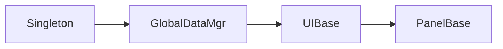

# D — AI 增强与 Token 优化

> 状态: 规划中
> 核心问题: AI Agent 消费 Wiki 时，token 就是成本。如何用最少的 token 输出最有价值的内容？

---

## 问题

当前 Wiki 输出是"全文搬运"——入库时只做机械提取（拆 frontmatter、分章节、建索引），没有做任何内容理解。所有理解成本都推迟到查询时，每次查询都要重复花。

## 核心洞察：三层输出

同一个源文件，可以产出三个层次的 Wiki 页面。每层是对上一层的**一次递归压缩/总结**：

```
原始源码（.cs / .md / .py ...）
    │  机械提取 — 不做理解
    ▼
🥉 Level 1 — 目录索引 + 原文
    │  逐页理解 — 每页独立
    ▼
🥈 Level 2 — 目录 + 摘要 + 关键词 + 原文
    │  跨页理解 — 建立关系
    ▼
🥇 Level 3 — 知识图谱 + 依赖分析 + 交叉引用 + 原文
```

### 🥉 Level 1 — 机械层

```
产出：
├── content/
│   ├── 快速开始.md        ← 原文，不做改动
│   ├── 核心架构/核心架构.md ← 原文
│   └── UI系统/UI系统.md    ← 原文
└── meta/
    └── index.json         ← 目录结构索引
```

- 不做任何内容理解
- 只建立目录树 + 文件结构索引
- Agent 需要自己逐篇翻看

### 🥈 Level 2 — 摘要层

```
核心架构/核心架构.md:
├── 📝 摘要 [新增]     ← "本系统采用单例管理器+基类继承..."
├── 🏷️ 关键词 [新增]   ← 单例、延迟初始化、全局管理器
└── [原文]

UI系统/UI系统.md:
├── 📝 摘要 [新增]     ← "UIBase 提供显示/隐藏动画..."
└── [原文]
```

- 每页独立理解，页与页之间不建立关系
- 新增：摘要、关键词
- Agent 扫一眼摘要就能判断需不需要读全文

### 🥇 Level 3 — 图谱层

```
核心架构/核心架构.md:
├── 📝 摘要
├�── 🏗️ 架构图 [新增]   ← Mermaid 图
├── 🔗 依赖分析 [新增]  ← UI系统 ↔ 核心架构
└── 📎 交叉引用 [新增]  ← 相关页面链接

📊 知识图谱概览 [新增]:
核心架构 ──依赖──→ UI系统
核心架构 ──依赖──→ 控制器
UI系统 ──使用──→ 数据系统
```

- 跨页理解，建立页面间关系
- 新增：架构图、依赖分析、交叉引用、知识图谱
- Agent 可以"顺着关系链"探索，而不是盲目翻页

## 三层 vs 三档

每层可以选择不同的后端实现：

- **Local** — Level 1: ✅, Level 2: ⚠️ 摘要粗糙, Level 3: ❌ 质量不够
- **Remote** — Level 1: ✅, Level 2: ✅, Level 3: ✅ 图谱+关系

所以用户的选择不是"选哪档"，而是**选到哪一层**：

- `--catalog-level 1` — 只要目录索引（最快）
- `--catalog-level 2` — 要摘要（推荐，性价比最高）
- `--catalog-level 3` — 要完整知识图谱（最贵）

每层兼容低层：Level 3 包含 Level 2+Level 1，Level 2 包含 Level 1。

## 设计要点

1. **递归压缩** — 每层是对上一层的更高维度总结
2. **层间兼容** — 高层包含低层所有内容
3. **向后兼容** — 现有 Level 1/2/3 目录结构不变
4. **渐进增强** — 先跑 Level 1 就能用，逐步升级到 Level 2/3

---

## Level 2 详细设计 — LLM 摘要流水线

### 核心目标

对每个源文件独立运行 LLM 调用，产出"摘要 + 关键词"，不跨页面建立关系。

### 输入

```
FileInfo {
    path: "核心架构/核心架构.md"
    extension: ".md"        // 决定处理策略
    content: "..."          // 全文
    frontmatter: {          // 如有
        title: "核心架构设计"
        tags: ["架构"]
    }
}
```

### 输出（写入 Page 模型）

```go
type Page struct {
    // ... 已有字段
    Abstract  string   // 新增: 50-100 token 摘要
    Keywords  []string // 新增: 3-10 个关键词
    Category  string   // 已有: 分类
    Language  string   // 新增: 检测到的语言 (cs/go/md/txt)
}
```

### 处理流程

```
文件路径 + 内容
    │
    ▼
① 文件类型检测
    ├── .cs .go .py .js → 代码文件
    ├── .md .mdx        → 文档文件
    ├── .json .yaml .toml → 配置文件
    └── .txt .其他       → 纯文本
    │
    ▼
② 内容预处理（适配 Prompt）
    ├── 代码 → 「这是一个 C# 代码文件，请理解它的功能...」
    ├── 文档 → 直接阅读
    └── 配置 → 「这是一个 JSON 配置文件...」
    │
    ▼
③ LLM 调用（1 轮）
    ├── Prompt → 请求摘要+关键词
    ├── 输出格式 → JSON { summary, keywords }
    ├── Remote: 一次完成，质量高
    └── Local: 可能需要 2 轮（先总结再提取关键词）
    │
    ▼
④ 后处理
    ├── 验证 JSON 完整性
    ├── 截断摘要 ≤ 100 token
    ├── 去重关键词
    └── 写入 Page.Abstract + Page.Keywords
```

### Prompt 模板

**代码文件（Remote）：**

```text
你是代码分析师。阅读以下 {{语言}} 代码，输出 JSON：
{
  "summary": "50-100 token 中文摘要，概括这个文件的职责和核心逻辑",
  "keywords": ["3-10 个中文关键词"]
}

代码文件: {{路径}}
---
{{内容}}
```

**代码文件（Local，更详细的 SOP）：**

```text
你是代码分析师。请一步步思考：

步骤 1：这个文件定义了什么类/函数？
步骤 2：它的核心职责是什么？
步骤 3：它依赖了哪些其他模块？
步骤 4：它被哪些其他模块依赖？

最后输出 JSON:
{
  "summary": "50-100 字总结",
  "keywords": ["关键词1", "关键词2", ...]
}

代码文件: {{路径}}
---
{{内容}}
```

**文档文件（.md）：**

```text
你是文档分析师。阅读以下 Markdown 文档，输出 JSON：
{
  "summary": "50-100 token 中文摘要，概括文档核心内容",
  "keywords": ["3-10 个中文关键词"]
}

文档路径: {{路径}}
---
{{内容}}
```

### 批量处理策略

```
场景 A: 首次全量（1000 个文件）
├── Remote: 逐个调用，支持并发 (concurency=5)
├── Local:  逐个调用，串行更稳定
├── 断点续传: 每处理一个写入一次结果
└── 进度报告: "已处理: 342/1000"

场景 B: 增量更新（变更 5 个文件）
├── 只处理变更文件
├── 从 meta 读取已有结果，合并
└── 用户无感知
```

### 错误处理

- **LLM 返回格式错误** — 重试 1 次，失败则跳过该页（记录告警）
- **文件内容为空** — 跳过，不调用 LLM
- **文件 > 1MB（代码）** — 截断后 500KB，LLM 看尾部（关键信息通常在最后）
- **LLM 超时** — 跳过该页，记录日志，继续下一页
- **网络中断（Remote）** — 指数退避重试，3 次失败后标记为"待补"

---

## Level 3 详细设计 — 知识图谱流水线

### Level 3 核心目标

### 两轮架构

```
第一轮: 实体提取 (Per-Page)
    ┌── 可在 Level 2 时一并完成 ──┐
    │ 每个页面: 提取"定义了/使用了/依赖了"的实体  │
    └──────────────────────────────┘
                │
                ▼
第二轮: 关系发现 (Cross-Page)
    ┌──────────────────────────────┐
    │ 输入: 所有页面的实体列表       │
    │ 处理: LLM 分析实体之间的关联   │
    │ 输出: 关系列表                │
    └──────────────────────────────┘
```

### 第一轮：实体提取

**时机：** 与 Level 2 合成一轮调用，不额外增加 LLM 调用次数

**输出扩展：**

```json
{
  "summary": "...",
  "keywords": ["..."],
  "entities": [            // 新增
    {"name": "Singleton<T>", "type": "class", "role": "defined"},
    {"name": "GlobalDataMgr", "type": "class", "role": "uses"}
  ]
}
```

**实体类型：**

- `class` — 类定义/使用，如 `Singleton<T>`
- `interface` — 接口，如 `IObj`
- `function` — 函数/方法，如 `Show()`, `Hide()`
- `module` — 模块/命名空间，如 `GlobalManagement`
- `concept` — 概念/模式，如"延迟初始化"

**实体角色：**

- `defined` — 本文件定义了这个实体
- `imports` — 本文件引用了这个实体
- `implements` — 本文件实现了这个接口
- `uses` — 本文件使用了这个实体

### 第二轮：关系发现

**输入（来自所有页面的 Level 2 输出）：**

```json
[
  {
    "path": "核心架构/核心架构.md",
    "summary": "本系统采用单例管理器+基类继承...",
    "keywords": ["单例模式", "全局管理器"],
    "entities": [
      {"name": "Singleton<T>", "type": "class", "role": "defined"},
      {"name": "GlobalDataMgr", "type": "class", "role": "uses"}
    ]
  },
  {
    "path": "UI系统架构/UI系统架构.md",
    "summary": "UIBase 提供显示/隐藏动画...",
    "keywords": ["UIBase", "面板管理"],
    "entities": [
      {"name": "UIBase", "type": "class", "role": "defined"},
      {"name": "Singleton<T>", "type": "class", "role": "uses"}
    ]
  }
]
```

**LLM 调用（Local 需分批次）：**

```text
你是架构分析师。以下是一个项目的所有文件摘要，请分析它们之间的关系。

输出 JSON：
{
  "relations": [
    {
      "source": "文件路径1",
      "target": "文件路径2",
      "relation": "depends_on | uses | implements | extends | related_to",
      "description": "为什么有关系"
    }
  ],
  "layers": [
    {
      "name": "管理层",
      "files": ["文件1", "文件2"],
      "description": "全局管理器层"
    }
  ]
}

文件列表:
---
{{所有文件 Level 2 输出}}
```

**分批策略（Local LLM 上下文限制）：**

```
100 个文件 → 分成 5 批 × 20 个
    │
    ▼
第 1 批: 文件 1-20 → 子图 A
第 2 批: 文件 21-40 → 子图 B
...
    │
    ▼
合并轮: 所有子图 → 全局图
    │
    ▼
去重 + 一致性校验
```

### 产出物

**在每页中追加：**

```markdown
## 🔗 依赖关系

- 依赖: [UI系统架构](UI系统架构/) — UIBase 继承自 MonoBehaviour
- 被依赖: [控制器系统](控制器系统/) — 通过 GlobalCameraMgr 引用
```

**在根目录生成：**

```markdown
# 📊 知识图谱概览

## 架构分层

| 层 | 包含页面 | 说明 |
|:--:|---------|------|
| 管理层 | 全局管理器系统 | 跨场景资源管理 |
| 表现层 | UI系统架构 | 面板化界面组织 |

## 依赖关系图



## 页面关系

- 核心架构设计 ↔ UI系统架构 (UIBase 继承体系)
- 核心架构设计 ↔ 控制器系统 (输入集成)
```

### 存储格式

```json
// meta/repowiki-graph.json
{
  "version": 1,
  "nodes": [
    {"path": "核心架构/核心架构.md", "title": "核心架构设计", "layer": "架构"},
    {"path": "UI系统架构/UI系统架构.md", "title": "UI系统架构", "layer": "表现层"}
  ],
  "edges": [
    {"source": "核心架构/核心架构.md", "target": "UI系统架构/UI系统架构.md", "type": "depends_on"}
  ],
  "layers": [
    {"name": "管理层", "member_paths": ["全局管理器系统/全局管理器系统.md"]}
  ]
}
```

### Remote vs Local 差异

- **一轮实体提取** — Remote: ✅ 一步到位 / Local: ⚠️ 需要更细的 SOP 指引
- **关系发现** — Remote: ✅ 100 页一次搞定 / Local: ❌ 必须分批，分批后还需合并轮
- **架构图质量** — Remote: ✅ Mermaid 直接可用 / Local: ⚠️ 可能语法错误，需要校验
- **处理时间** — Remote: 秒级 / Local: 分钟~小时级
- **成本** — Remote: 最高 / Local: 接近 0
